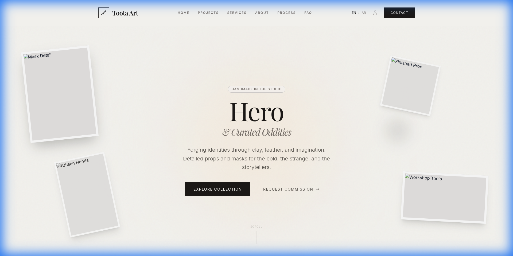
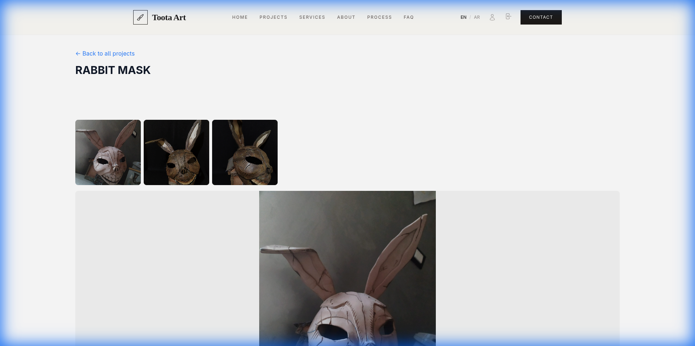
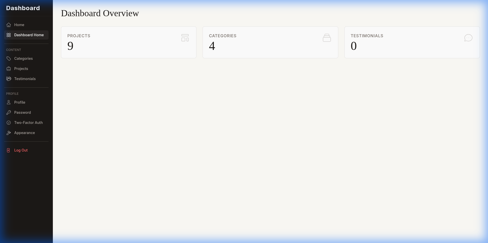
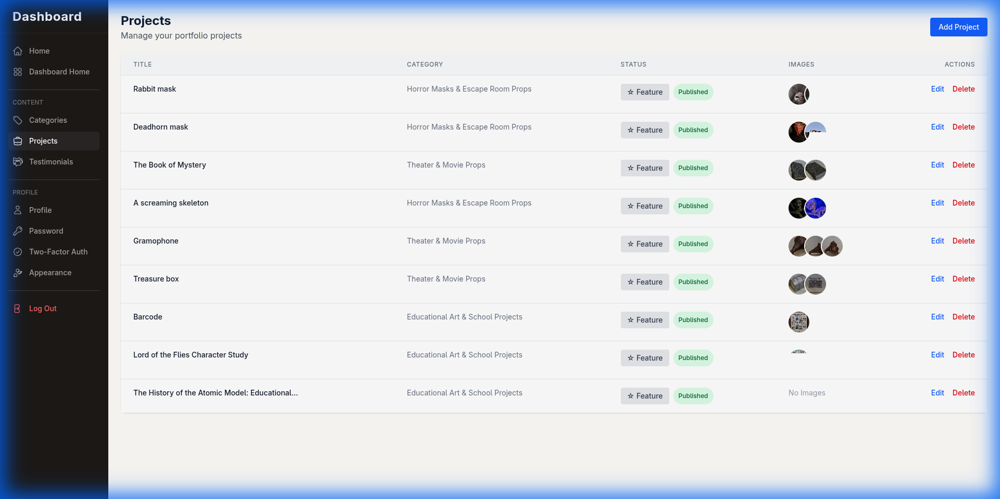
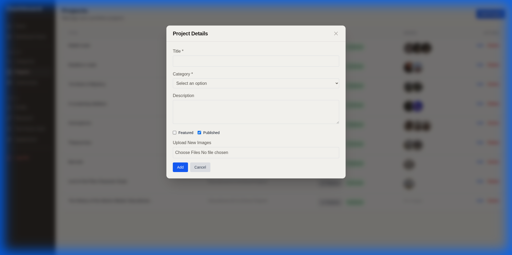
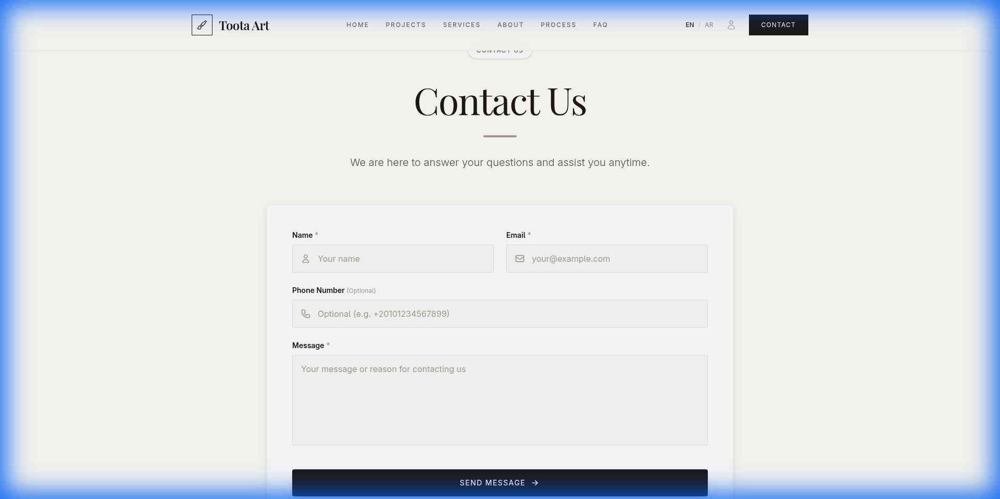
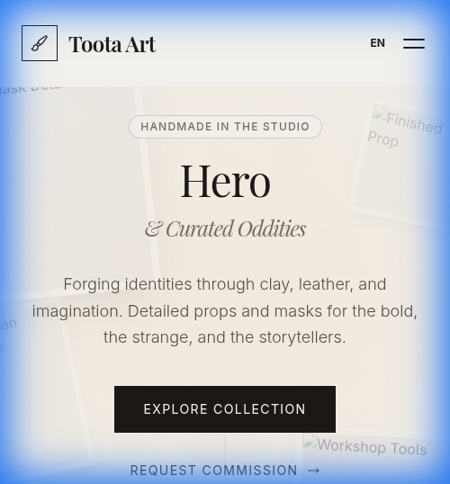

# 🎨 Toota Art Portfolio


> **Live Demo**: [https://toota-art.ahmedlotfy.site](https://toota-art.ahmedlotfy.site)

A high-performance, dynamic portfolio application designed to showcase artistic projects with elegance and speed. Built with a modern TALL stack (Tailwind, Alpine, Laravel, Livewire) and optimized for seamless content management.



---

## 🚀 Why & What

### The "Why"

Artists need a platform that doesn't just store their work but **elevates** it. Generic website builders often lack the performance or the specific customizability needed for a truly professional portfolio. Toota Art was built to solve this by providing a blazing-fast, SEO-optimized, and easy-to-manage solution.

### The "What"

**Toota Art** is a full-stack web application that serves as both a public-facing portfolio and a private content management system. It allows for:

-   **Effortless Management**: A custom dashboard to manage projects, categories, and testimonials without touching code.
-   **Optimized Performance**: Images are automatically optimized and served via Cloudflare R2 for instant loading.
-   **Dynamic Experience**: Smooth transitions and interactive elements powered by Livewire and Alpine.js.
-   **Bilingual Support**: Full support for English and Arabic languages with RTL layout.

---

## ✨ Key Features

### 1. 🔐 Secure Authentication & Access Control

Security and ease of use are top priorities for protecting the artist's dashboard.

-   **Registration Closed**: Public registration is completely disabled to ensure **only the artist** can access the dashboard. No unauthorized users can create accounts.
-   **Social Login (Google)**: Integrated using **Laravel Socialite**. The artist can log in with a single click using their Google account, eliminating the need to remember passwords.
-   **Traditional Login**: Email and password authentication with Laravel Fortify for flexibility.
-   **Two-Factor Authentication**: Optional 2FA support for enhanced security.
-   **Role-Based Access**: Strict middleware ensures that only authenticated users can access administrative routes.

### 2. 🖼️ Dynamic Portfolio Showcase

A visually stunning frontend that displays projects in a responsive grid with smooth animations.

-   **Filtering**: Filter projects by category instantly with dynamic updates.
-   **Detail View**: Rich project details with support for multiple images and comprehensive descriptions.
-   **Masonry Layout**: Adapts beautifully to different image aspect ratios.
-   **Lazy Loading**: Images load progressively for optimal performance.
-   **Smooth Transitions**: Elegant animations powered by Alpine.js.



### 3. 🎛️ Admin Dashboard

A secure, feature-rich dashboard for managing all site content with real-time updates.



#### Dashboard Features:

-   **Statistics Overview**: Quick view of total projects, categories, and testimonials.
-   **Project Management**: Create, edit, and delete projects using dedicated Livewire components.
-   **Status Control**: Toggle "Published" or "Featured" status with a single click.
-   **Category Management**: Organize work into categories with custom icons and colors.
-   **Testimonial Management**: Display social proof and client feedback.
-   **Real-time Updates**: Changes reflect immediately without page refreshes.



#### Project Creation & Editing:

The project form includes comprehensive fields for managing artwork:

-   **Bilingual Content**: Separate fields for English and Arabic titles and descriptions.
-   **Category Assignment**: Easy dropdown selection for project categorization.
-   **Status Toggles**: Control published and featured status.
-   **Multi-Image Upload**: Drag-and-drop interface for uploading multiple project images.
-   **Image Management**: Preview, reorder, and delete images with ease.



### 4. 🗂️ Category Management

Organize projects into meaningful categories with visual customization.


-   **Custom Icons**: Assign unique icons to each category.
-   **Color Coding**: Visual distinction with custom color schemes.
-   **Project Count**: Track the number of projects in each category.
-   **Bilingual Names**: Support for both English and Arabic category names.

### 5. ☁️ Smart Image Management

Forget about slow uploads or broken images with our intelligent image handling system.

-   **Cloudflare R2 Integration**: Images are stored securely in the cloud, not on the server, ensuring scalability and reliability.
-   **Drag & Drop Uploader**: A custom-built Livewire component for easy multi-image uploads with visual feedback.
-   **Auto-Optimization**: Images are automatically converted to WebP format and resized for optimal performance.
-   **Replace Strategy**: Updating a project automatically cleans up old images to prevent storage clutter.
-   **CDN Delivery**: Fast global image delivery through Cloudflare's network.
-   **Preview & Delete**: Real-time image preview with individual deletion capabilities.

### 6. 📧 Contact Form

Integrated contact form for visitors to reach out directly.



-   **Form Validation**: Client and server-side validation for data integrity.
-   **Email Notifications**: Automatic email notifications for new submissions.
-   **Spam Protection**: Built-in protection against spam submissions.
-   **Responsive Design**: Works seamlessly on all devices.

### 7. 🗺️ Automated SEO & Sitemaps

Built to be found by search engines and rank well.

-   **Automated Sitemaps**: Uses `spatie/laravel-sitemap` to automatically generate an XML sitemap (`sitemap.xml`) for all published projects.
-   **Daily Regeneration**: The sitemap is regenerated daily via scheduled commands to ensure search engines always have the latest content.
-   **SEO-Friendly URLs**: All projects use slug-based URLs (e.g., `/project/my-awesome-art`) for better ranking.
-   **Meta Tags**: Automatic generation of meta descriptions and Open Graph tags.
-   **Structured Data**: Schema.org markup for rich search results.

### 8. 🌍 Bilingual Support (English & Arabic)

Full internationalization support for reaching a wider audience.

-   **Language Switcher**: Easy toggle between English and Arabic.
-   **RTL Layout**: Proper right-to-left layout for Arabic content.
-   **Translated UI**: All interface elements available in both languages.
-   **Bilingual Content**: Projects, categories, and testimonials support both languages.
-   **SEO for Both Languages**: Proper hreflang tags and language-specific sitemaps.

### 9. 📱 Fully Responsive Design

Looks stunning on every device, from mobile phones to large desktop screens.



-   **Mobile-First Approach**: Designed for mobile devices first, then enhanced for larger screens.
-   **Touch-Friendly**: Optimized touch targets and gestures for mobile users.
-   **Adaptive Layouts**: Grid layouts that adjust beautifully to any screen size.
-   **Performance Optimized**: Fast loading times even on slower mobile connections.

### 10. 🧩 Reusable UI Component Library

Built with maintainability in mind using a comprehensive set of custom Blade components.

-   **UI Kit Components**: Buttons, Inputs, Badges, Modals, Cards, and more.
-   **Consistent Design**: Unified design language across the entire application.
-   **Dark Mode Ready**: Native support for dark mode styling (can be enabled).
-   **Accessibility**: ARIA labels and keyboard navigation support.
-   **Customizable**: Easy to extend and customize for specific needs.

### 11. 🎭 Testimonials System

Showcase client feedback and build trust with potential clients.

-   **Client Management**: Add, edit, and delete client testimonials.
-   **Rich Content**: Support for client names, roles, companies, and detailed feedback.
-   **Display Control**: Choose which testimonials to feature on the homepage.
-   **Bilingual Testimonials**: Support for testimonials in both English and Arabic.

### 12. � Newsletter Subscription

Build an audience with integrated newsletter functionality.

-   **Email Collection**: Capture visitor emails for future communications.
-   **Validation**: Prevent duplicate subscriptions and invalid emails.
-   **Export Capability**: Easy export of subscriber lists.
-   **Privacy Compliant**: GDPR-ready with proper consent mechanisms.

---

## �🛠️ Tech Stack

We chose the **TALL Stack** for its perfect balance of developer experience and performance.

| Technology            | Purpose           | Why we used it                                                                                                   |
| :-------------------- | :---------------- | :--------------------------------------------------------------------------------------------------------------- |
| **Laravel 11**        | Backend Framework | The industry standard for PHP. Provides robust routing, security, and database management with modern features.  |
| **Livewire 3**        | Dynamic Frontend  | Allows us to build dynamic interfaces (like the dashboard) without the complexity of a separate SPA (React/Vue). |
| **Alpine.js**         | Interactivity     | Adds lightweight JavaScript behavior (modals, dropdowns) directly in the HTML with minimal overhead.             |
| **Tailwind CSS**      | Styling           | Utility-first CSS for rapid, custom UI development without fighting framework defaults.                          |
| **Cloudflare R2**     | Storage           | S3-compatible object storage that eliminates egress fees and ensures fast global delivery.                       |
| **Laravel Socialite** | Authentication    | Simplifies OAuth authentication with providers like Google for seamless login.                                   |
| **Laravel Fortify**   | Authentication    | Provides backend authentication features including 2FA, password reset, and email verification.                  |
| **Spatie Sitemap**    | SEO               | Automatically generates XML sitemaps to improve search engine indexing.                                          |
| **MySQL**             | Database          | Reliable, performant relational database for storing all application data.                                       |

---

## 📂 Project Structure

The project follows a clean, domain-driven structure for maintainability and scalability:

```
toota-art/
├── app/
│   ├── Console/
│   │   └── Commands/          # Custom artisan commands (GenerateSitemap)
│   ├── Http/
│   │   ├── Controllers/       # Request handling (GoogleAuthController, ImageUploadController)
│   │   ├── Livewire/          # Reactive components
│   │   │   ├── Dashboard/     # Dashboard-specific components
│   │   │   ├── Forms/         # Form components
│   │   │   ├── Pages/         # Page components
│   │   │   └── Settings/      # User settings components
│   │   └── Middleware/        # Custom middleware
│   ├── Mail/                  # Email templates (ContactFormSubmitted)
│   ├── Models/                # Eloquent models (Project, Category, Testimonial, User)
│   └── Services/              # Business logic services (ProjectService)
├── config/
│   ├── filesystems.php        # Cloudflare R2 configuration
│   ├── fortify.php            # Authentication configuration
│   └── services.php           # Third-party service configuration
├── database/
│   ├── migrations/            # Database schema definitions
│   └── seeders/               # Database seeders
├── resources/
│   ├── css/                   # Tailwind CSS files
│   ├── js/                    # Alpine.js and custom JavaScript
│   ├── lang/                  # Language files (en, ar)
│   └── views/
│       ├── components/        # Blade components
│       │   ├── ui/            # Reusable UI components
│       │   └── dashboard/     # Dashboard-specific components
│       └── livewire/          # Livewire component views
├── routes/
│   └── web.php                # Application routes
└── tests/                     # PHPUnit tests
```

---

## ⚡ Getting Started

### Prerequisites

-   **PHP 8.2+** with required extensions (mbstring, xml, pdo, etc.)
-   **Composer** for PHP dependency management
-   **Node.js 18+** & **NPM** for frontend asset compilation
-   **MySQL 8.0+** or compatible database
-   **Cloudflare R2 Account** for image storage (or configure alternative S3-compatible storage)
-   **Google OAuth Credentials** (optional, for social login)

### Installation

1.  **Clone the repository**

    ```bash
    git clone https://github.com/ahmed-lotfy-dev/toota-portfolio.git
    cd toota-portfolio
    ```

2.  **Install Dependencies**

    ```bash
    composer install
    npm install
    ```

3.  **Environment Setup**

    ```bash
    cp .env.example .env
    php artisan key:generate
    ```

    **Configure your `.env` file with:**

    -   Database credentials (DB_DATABASE, DB_USERNAME, DB_PASSWORD)
    -   Cloudflare R2 credentials (AWS_ACCESS_KEY_ID, AWS_SECRET_ACCESS_KEY, AWS_BUCKET, AWS_ENDPOINT)
    -   Google OAuth credentials (GOOGLE_CLIENT_ID, GOOGLE_CLIENT_SECRET)
    -   Mail server configuration for contact form notifications
    -   Allowed admin email (ADMIN_EMAIL)

4.  **Run Migrations & Seeders**

    ```bash
    php artisan migrate --seed
    ```

    _Note: The seeder creates an initial admin user based on your environment variables._

5.  **Build Frontend Assets**

    ```bash
    npm run build
    # or for development with hot reload:
    npm run dev
    ```

6.  **Start Development Server**

    ```bash
    php artisan serve
    ```

    Visit `http://localhost:8000` to see your portfolio!

### Production Deployment

For production deployment, ensure you:

1.  Set `APP_ENV=production` and `APP_DEBUG=false` in `.env`
2.  Run `php artisan config:cache` and `php artisan route:cache`
3.  Build production assets with `npm run build`
4.  Set up a proper web server (Nginx/Apache) with PHP-FPM
5.  Configure SSL certificates for HTTPS
6.  Set up scheduled tasks for sitemap generation:

    ```bash
    * * * * * cd /path-to-your-project && php artisan schedule:run >> /dev/null 2>&1
    ```

---

## 🎨 Key Design Decisions

### Why TALL Stack?

The TALL stack (Tailwind, Alpine, Laravel, Livewire) was chosen for several strategic reasons:

1.  **Single Language**: Write everything in PHP and minimal JavaScript, reducing context switching.
2.  **Real-time Reactivity**: Livewire provides SPA-like experience without the complexity of a separate frontend framework.
3.  **Rapid Development**: Tailwind's utility classes and Livewire's component system enable fast iteration.
4.  **SEO-Friendly**: Server-side rendering ensures search engines can properly index content.
5.  **Maintainability**: Fewer moving parts mean easier long-term maintenance.

### Why Cloudflare R2?

-   **Zero Egress Fees**: Unlike AWS S3, R2 doesn't charge for bandwidth, making it cost-effective.
-   **S3 Compatible**: Easy migration and familiar API.
-   **Global CDN**: Automatic content delivery optimization worldwide.
-   **Reliability**: Built on Cloudflare's robust infrastructure.

### Architecture Highlights

-   **Service Layer**: Business logic is extracted into service classes (e.g., `ProjectService`) for reusability and testing.
-   **Component-Based UI**: Blade components provide a consistent, maintainable design system.
-   **Livewire for Interactivity**: Complex interactions (forms, modals, real-time updates) use Livewire for a seamless UX.
-   **Alpine for Micro-Interactions**: Small UI behaviors (dropdowns, toggles) use Alpine.js for lightweight interactivity.

---

## 🔒 Security

Security is a top priority in Toota Art:

-   **Authentication**: Powered by Laravel Fortify with support for traditional login and OAuth.
-   **Authorization**: Role-based access control with middleware protecting all admin routes.
-   **CSRF Protection**: All forms protected against cross-site request forgery.
-   **SQL Injection Prevention**: Eloquent ORM and prepared statements prevent SQL injection.
-   **XSS Prevention**: All inputs are validated and sanitized, outputs are escaped.
-   **Password Hashing**: Bcrypt hashing for secure password storage.
-   **Two-Factor Authentication**: Optional 2FA for enhanced account security.
-   **Rate Limiting**: Protection against brute force attacks on login and contact forms.
-   **Secure Headers**: Proper security headers configured for production.

---

## 🧪 Testing

The application includes comprehensive tests to ensure reliability:

```bash
# Run all tests
php artisan test

# Run specific test suite
php artisan test --testsuite=Feature

# Run with coverage
php artisan test --coverage
```

Test coverage includes:

-   **Feature Tests**: End-to-end testing of major workflows (authentication, project CRUD, etc.)
-   **Unit Tests**: Individual component and service testing
-   **Browser Tests**: Automated browser testing with Laravel Dusk (if configured)

---

## 📈 Performance Optimizations

-   **Image Optimization**: Automatic WebP conversion and responsive image sizing
-   **Lazy Loading**: Images load only when visible in viewport
-   **Database Indexing**: Proper indexes on frequently queried columns
-   **Query Optimization**: Eager loading to prevent N+1 queries
-   **Caching**: Route, config, and view caching in production
-   **Asset Minification**: CSS and JavaScript minified and versioned
-   **CDN Delivery**: Static assets served through Cloudflare CDN

---

## 🚀 Future Enhancements

Potential features for future development:

-   **Blog System**: Add a blog for sharing artistic insights and processes
-   **E-commerce Integration**: Sell prints or original artwork directly
-   **Advanced Analytics**: Track visitor behavior and popular projects
-   **Social Media Integration**: Auto-post new projects to social platforms
-   **Client Portal**: Allow clients to view private projects and provide feedback
-   **Advanced Search**: Full-text search across projects with filters
-   **Video Support**: Embed video content in project galleries
-   **API**: RESTful API for third-party integrations

---

## 📄 License

This project is proprietary software developed for Toota Art. All rights reserved.

---

## 👨‍💻 Developer

**Ahmed Lotfy**  
Full-Stack Developer | Laravel Specialist

-   **GitHub**: [@ahmed-lotfy-dev](https://github.com/ahmed-lotfy-dev)
-   **Email**: contact@ahmedlotfy.site
-   **Portfolio**: [ahmedlotfy.site](https://ahmedlotfy.site)

---

## 🙏 Acknowledgments

-   **Laravel Team**: For the amazing framework
-   **Livewire Team**: For making reactive interfaces simple
-   **Tailwind CSS**: For the utility-first CSS framework
-   **Spatie**: For excellent Laravel packages
-   **Cloudflare**: For reliable infrastructure and R2 storage

---

Made with ❤️ and ☕ by [Ahmed Lotfy](https://github.com/ahmed-lotfy-dev)

> **Note**: This is a production application currently serving real traffic at [toota-art.ahmedlotfy.site](https://toota-art.ahmedlotfy.site)
